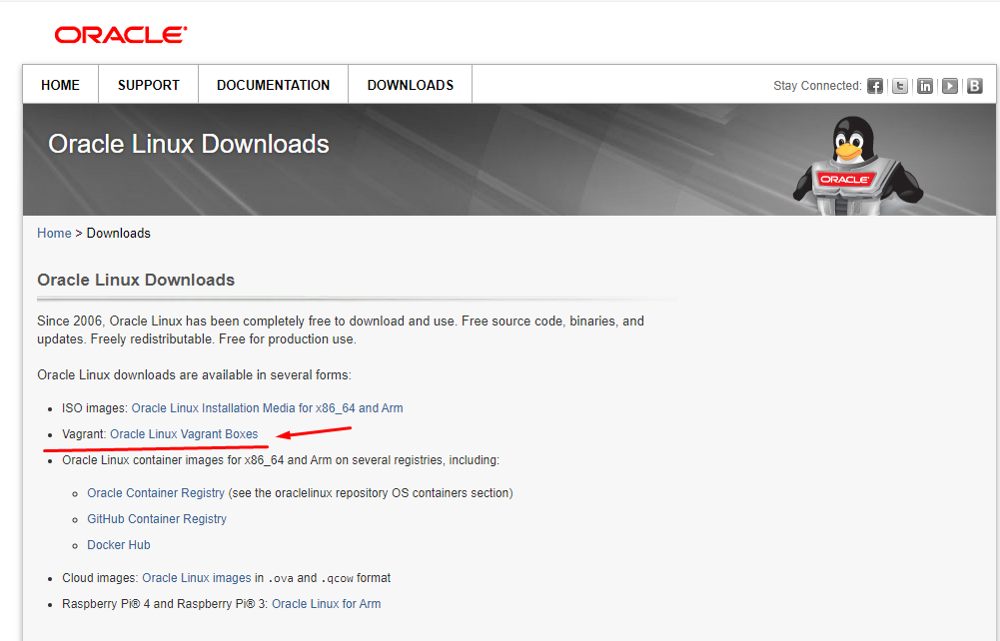

### Deploy a lab with Oracle Linux 9 by Vagrant

- **This tutorial assumes that you already have Oracle VM Virtualbox and Vagrant installed on your computer.**

- **We will use the default configurations for this lab.**


1. First, you need to go to Oracle's Linux Download [page](https://yum.oracle.com/oracle-linux-downloads.html).

2. Choose the second option: Vagrant.
   
   

3. The next step is the execution of the following commands:
   
   I. Init the project and download the box to our local machine:
      
      ```shell
         $ mkdir -p OL-9
         $ cd OL-9
         $ vagrant init oraclelinux/9 https://oracle.github.io/vagrant-projects/boxes/oraclelinux/9.json
      ```

    II.  Start the VM and proceed to the SSH connection:

         ```shell
           $ vagrant up
           $ vagrant ssh
         ```

     III. Finally, execute your tasks and tests. To shutdown the VM, log off and use this command:

         ```shell
            $ vagrant halt
         ```
